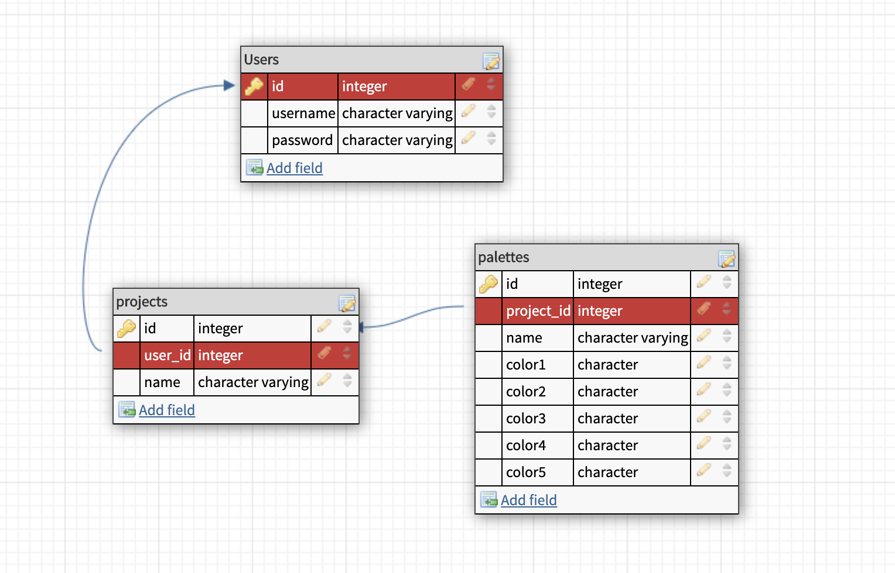

# Noir Films Api
This API is intended to be used for the _Noir Films_ movie club. It uses it's own data, as well as data provided by [The MovieDB](https://developers.themoviedb.org/3/getting-started) to keep track of movies the group would like to see, as well as which movies they have already seen.

## Contributors 
- [Scott Schipke](https://github.com/sschipke)


### Technologies 
This api was almost written entirely in JavaScript using the following libraries and frameworks
- Node.js
- Express.js
- Knex
- Postgresql for database management

### Schema 
<details>
<summary>Data flow and database schema (PSQL)</summary>


</details>

### Use of this api
 Use this api to create, and login users. Once they have been established it is then possible to add projects for a user and each project can then contain multiple palettes (one to many relationship). There are endpoints for: 
 - creating and logging in users
 - adding projects or palettes
 - deleting tesprojects or palettes
 - update projects or palet

 <details>
  <summary> <code>POST</code> and <b>Create</b>
  a new user </summary>

  example request : `POST` `/api/v1/signup`
  <br>
  example successful response: 

  ```json
{
  "username": "Debra",
  "id": 7
}
  ```

  example <b>un</b>successful response: 

  ```json
{
    "error": "Expected format: {username: <string>, password <string>. You're missing a 'password' property."
}
```
### Required Keys in body of request:
| Key        | Datatype           |
| :-------------: |:-------------:|
| username      | `<string>` |
| password      | `<boolean>`      |

### Statuses:
 | Status        | Meaning           |
| :-------------: |:-------------:|
| `201`      | Success |
| `422`      | Missing a required parameter     |

</details>

---

 <details>
  <summary> <code>POST</code> and <b>Log in</b> an already existing user </summary>

  example request : `POST` `/api/v1/login`
  <br>
  example successful response: 

  ```json
{
    "id": 1,
    "username": "Greg"
}
  ```

  example <b>un</b>successful response: 

  ```json
{
    "error": "Username or password incorrect"
}
```
### Required Keys in body of request:
| Key        | Datatype           |
| :-------------: |:-------------:|
| username      | `<string>` |
| password      | `<boolean>`      |
### Statuses:
 | Status        | Meaning           |
| :-------------: |:-------------:|
| `200`      | Success |
| `401`      | Submitted username and/or password is incorrect     |

</details>

---

 <details>
  <summary> <code>GET</code> all the projects for a specific user </summary>

  example request : `GET` `/api/v1/users/:user_id/projects`
  <br>
  example successful response: 

  ```json
[
  {
      "id": 2,
      "user_id": 2,
      "name": "Nature",
      "created_at": "2019-12-05T21:21:16.669Z",
      "updated_at": "2019-12-05T21:21:16.669Z"
  }
]
  ```

  example <b>un</b>successful response <b>or</b> if no projects exist for that user: 

  ```json
{
    "error": "No projects yet!"
}
```
### Statuses:
 | Status        | Meaning           |
| :-------------: |:-------------:|
| `200`      | Success |
| `404`      | Project does not exist <b>OR</b> the user hasn't created any projects yet    |

</details>

---
 <details>
  <summary> <code>GET</code> a single project using its id </summary>

  example request : `GET` `/api/v1/projects/:id`
  <br>
  example successful response: 

  ```json
{
    "id": 2,
    "user_id": 2,
    "name": "Nature",
    "created_at": "2019-12-05T21:21:16.669Z",
    "updated_at": "2019-12-05T21:21:16.669Z"
}
  ```

  example <b>un</b>successful response 

  ```json
{
    "message": "No project with an id of 100 was found!"
}
```
### Statuses:
 | Status        | Meaning           |
| :-------------: |:-------------:|
| `200`      | Success |
| `404`      | Project does not exist   |

</details>

---
<details>
  <summary> <code>GET</code> the palettes for a project</summary>

  example request : `GET` `/api/v1/projects/:project_id/palettes/`
  <br>
  example successful response: 

  ```json
[
    {
        "id": 1,
        "project_id": 2,
        "name": "greens",
        "color1": "#FF6786",
        "color2": "#1DA156",
        "color3": "#087839",
        "color4": "#00ff6e",
        "color5": "#008c3d",
        "created_at": "2019-12-05T21:21:16.671Z",
        "updated_at": "2019-12-05T21:21:16.671Z"
    },
    { ... }
]
  ```

  example <b>un</b>successful response 

  ```json
{
    "error": "No palettes yet!"
}
```
### Statuses:
 | Status        | Meaning           |
| :-------------: |:-------------:|
| `200`      | Success |
| `404`      | No palettes for that project were found   |

</details>

---

<details>
  <summary> <code>POST</code> a new project to the database</summary>

  example request : `POST` `/api/v1/projects`
  <br>
  example successful response: 

  ```json
{
  "id": 4,
  "name": "Beach",
  "user_id": 3
}
  ```

  example <b>un</b>successful response 

  ```json
{
    "error": "Expected format: { user_id: <integer>, name: <string>}. You're missing a 'user_id' property."
}
```
### Required Keys in body of request:
| Key        | Datatype           |
| :-------------: |:-------------:|
| user_id     | `<number>` |
| name      | `<string>`      |

### Statuses:
 | Status        | Meaning           |
| :-------------: |:-------------:|
| `200`      | Success |
| `422`      | The object in the body was not formatted correctly   |

</details>

---
<details>
  <summary> <code>POST</code> a new palette to the database</summary>

  example request : `POST` `/api/v1/palettes`
  <br>
  example successful response: 

  ```json
{
    "id": 4,
    "name": "Sand",
    "project_id": "4",
    "color1": "#FF891B",
    "color2": "#FCDB18",
    "color3": "#DE776F",
    "color4": "#B63FFA",
    "color5": "#1102C3"
}
  ```

  example <b>un</b>successful response 

  ```json
{
    "error": "Expected format: { project_id: <integer>, name: <string>, color1:<hexcode>, color1]2:<hexcode>, color3:<hexcode>, color4:<hexcode>, color5:<hexcode>}. You're missing a 'project_id' property."
}
```
### Required Keys in body of request:
| Key        | Datatype           |
| :-------------: |:-------------:|
| user_id     | `<number>` |
| name      | `<string>`      |

### Statuses:
 | Status        | Meaning           |
| :-------------: |:-------------:|
| `200`      | Success |
| `422`      | The object in the body was not formatted correctly   |

</details>

---
<details>
  <summary> <code>PATCH</code> an update to a palette</summary>

  example request : `PATCH` `/api/v1/palettes/:id`
  <br>
  example successful response: 

  ```json
{
    "message": "[property] updated"
}
  ```

  example <b>un</b>successful response if no palette is found

  ```json
{
    "error": "No existing palette with id of 1"
}
```
  example <b>un</b>successful response if request body is invalid

  ```json
{
    "error": "You can only update a palette's <name>, <color1>, <color2>, <color3>, <color4>, <color5>, not [sent parameter]"
}
```
### Possible Keys in body of request:
| Key        | Datatype           |
| :-------------: |:-------------:|
| name      | `<string>`      |
| color1      | `<hex code>`      |
| color2      | `<hex code>`      |
| color3      | `<hex code>`      |
| color4      | `<hex code>`      |
| color5      | `<hex code>`      |

### Statuses:
 | Status        | Meaning           |
| :-------------: |:-------------:|
| `202`      | Success |
| `404`      | No palette was found with the id sent  |
| `422`      | Response body was not formatted correctly/did not have the correct property to update |
</details>

---
<details>
  <summary> <code>PATCH</code> an update to a project</summary>

  example request : `PATCH` `/api/v1/projects/:id`
  <br>
  example successful response: 

  ```json
{
    "message": "[property] updated"
}
  ```

  example <b>un</b>successful response if no project is found

  ```json
{
    "error": "No existing project with id of 3"
}
```
  example <b>un</b>successful response if request body is invalid

  ```json
{
    "error": "You can only update a project's <name>, not [sent property]"
}
```
### Possible Keys in body of request:
| Key        | Datatype           |
| :-------------: |:-------------:|
| name      | `<string>`      |

### Statuses:
 | Status        | Meaning           |
| :-------------: |:-------------:|
| `202`      | Success |
| `404`      | No project was found with the id sent  |
| `422`      | Response body was not formatted correctly (can only update the name) |
</details>

---
<details>
  <summary> <code>DELETE</code> a single project using its id </summary>

  example request : `DELETE` `/api/v1/projects/:id`
  <br>
  example successful response: 

  ```json
{
  "Project deleted"
}
  ```

  example <b>un</b>successful response 

  ```json
{
    "message": "No project with an id of 100 was found!"
}
```
### Statuses:
 | Status        | Meaning           |
| :-------------: |:-------------:|
| `200`      | Success |
| `404`      | Project does not exist   |

</details>

---
<details>
  <summary> <code>DELETE</code> a single palette using its id </summary>

  example request : `DELETE` `/api/v1/projects/:id`
  <br>
  example successful response: 

  ```json
{
  "Palette deleted"
}
  ```

  example <b>un</b>successful response 

  ```json
{
    "Palette with an id: 4 does not exist"
}
```
### Statuses:
 | Status        | Meaning           |
| :-------------: |:-------------:|
| `200`      | Success |
| `404`      | Palette does not exist   |

</details>

### Installation instructions
- below are instructions for using this application locally
- environment variables have been used to dynamically allow use of the API both locally and remotely

<details>
  <summary>Instructions for locally installing this API</summary>

  1. `clone` down this repo
  1. In the command line run: `$ npm i`
  1. Next run `$ npm start` 
  <br>
  The following message should appear:
  ```javascript
  Palette Producer is running on localhost:3001
  ```
  4. The API is now available for consumption locally

</details>